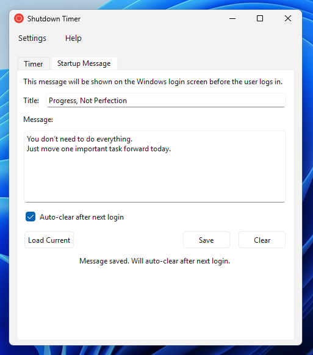

# Shutdown Timer

A Windows desktop utility for scheduling system shutdowns, restarts, hibernation, and sleep — and displaying a custom message on the Windows login screen before users log in.

> 🤖 **This application was entirely created by [Claude AI](https://claude.ai) (Anthropic).**

💡 Ideated, directed, and shipped by [@molnupiravir-faky](https://github.com/molnupiravir-faky) — no coding knowledge required.

---

## Screenshots

| ShutdownTimer Interface | Startup Message Tab |
|:---------:|:-------------------:|
|  |  |

---

## Features

- **Countdown Timer** — Set a duration (hours, minutes, seconds) and the system will perform the chosen action when it reaches zero. Quick preset buttons: 15 min, 30 min, 1 hour, 2 hours.
- **Scheduled Time** — Pick an exact date and time for the action using a calendar picker.
- **Shutdown, Restart, Hibernate, or Sleep** — Choose what happens when the timer fires. Shutdown and Restart support an optional *Force* mode that closes apps immediately without waiting for them to save. Hibernate and Sleep options are automatically greyed out if the machine doesn't support them, with a tooltip explaining why.
- **Live Countdown Display** — A large clock shows the remaining time while the timer is active. The system tray icon tooltip also updates in real time.
- **Startup Message** — Write a custom title and message body that will appear on the Windows login screen (via `LegalNoticeCaption` / `LegalNoticeText` registry values). Useful for IT notices, reminders, or personal messages.
- **Auto-Clear Message** — Optionally schedule the startup message to automatically remove itself after the next login, with no manual cleanup needed.
- **System Tray** — The app minimizes to the system tray. Closing the window hides it rather than quitting. A tray menu lets you show/hide, cancel a running timer, or quit.
- **9 Languages** — English, Arabic (with RTL layout), Korean, Spanish, French, German, Portuguese (Brazil), Chinese Simplified, and Japanese. Language preference is saved between sessions.
- **Persistent Settings** — Window position, size, and language are all remembered across restarts.

---

## How It Works

### Timer

When you click **Start**, the `TimerEngine` begins a 1-second tick loop. Rather than simply counting down, it recalculates the remaining time against the wall clock on every tick — this prevents drift if the computer sleeps or the timer is delayed.

When the timer reaches zero, `ShutdownManager` takes over. For **Shutdown** and **Restart**, it calls the Win32 API `InitiateSystemShutdownExW`, acquiring `SE_SHUTDOWN_NAME` privilege first (required on Windows even for administrators). If you hit **Cancel**, `AbortSystemShutdown` is called to stop the OS sequence. For **Hibernate** and **Sleep**, it calls `SetSuspendState()` instead — these are immediate with no delay, and the *Force* option does not apply. The app also checks power capabilities at startup using `GetPwrCapabilities()` and disables Hibernate or Sleep in the UI if the hardware or OS configuration doesn't support them.

### Startup Message

The message is written directly to the Windows registry at:

```
HKEY_LOCAL_MACHINE\SOFTWARE\Microsoft\Windows NT\CurrentVersion\Winlogon
  LegalNoticeCaption  →  your title
  LegalNoticeText     →  your message body
```

Windows reads these values at login and displays them on the lock/login screen before the user can sign in.

**Auto-Clear** works by creating a one-shot Windows Task Scheduler task (`ShutdownTimerAutoClearMsg`) that triggers on the next logon. At that point, the app runs headlessly with `--auto-clear`, clears the registry values, deletes the task, and exits — all before the Qt UI even loads.

> **Note:** The app requires **administrator privileges** (declared in its manifest). This is necessary for registry writes to `HKLM` and for calling the shutdown API.

---

## Building from Source

### Prerequisites

| Tool | Version | Download |
|------|---------|----------|
| Qt6 + MinGW 64-bit | 6.5 or newer | https://www.qt.io/download-qt-installer |
| CMake | 3.20 or newer | https://cmake.org/download |

When installing Qt, make sure to select the **MinGW 64-bit** toolchain and the **Qt Linguist** tools component.

---

### 1. Clone the repository

```bat
git clone https://github.com/molnupiravir-faky/Shutdown_timer.git
cd Shutdown_timer\ShutdownTimer
```

---

### 2. Configure and build

Open the **Qt 6.x MinGW 64-bit** command prompt (found in Start Menu → Qt folder), then:

```bat
cmake -B build -G "MinGW Makefiles" -DCMAKE_BUILD_TYPE=Release
cmake --build build --config Release
```

The compiled binary will be at `build/ShutdownTimer.exe`. The CMake build also automatically compiles all `.ts` translation files to `.qm` and places them in `build/i18n/`.

---

### 3. Deploy Qt runtime DLLs

The exe needs Qt's runtime DLLs to run on machines without Qt installed. Use `windeployqt`:

```bat
mkdir deploy
windeployqt --dir deploy build\ShutdownTimer.exe
copy build\ShutdownTimer.exe deploy\
xcopy /E /I build\i18n deploy\i18n
```

### Project Structure

```
src/main.cpp             Entry point + headless --auto-clear handler
src/MainWindow.*         Full UI — timer tab, startup message tab, tray
src/TimerEngine.*        Countdown and scheduled timer (drift-corrected)
src/ShutdownManager.*    Win32 shutdown/restart + SetSuspendState hibernate/sleep
src/RegistryManager.*    Win32 registry read/write for login screen message
src/TaskScheduler.*      COM ITaskService — create/delete auto-clear task
src/LanguageManager.*    QTranslator + RTL layout switching for Arabic
i18n/app_*.ts            Translation source files (9 languages)
assets/                  Application icons (ICO + PNG at multiple sizes)
app.manifest             UAC requireAdministrator + Windows 10/11 compat
resources.rc             Embeds manifest, icon, and version info into exe
CMakeLists.txt           Qt6 CMake build script
```

---

## Requirements

- Windows 10 or Windows 11 (64-bit)
- Administrator privileges (required for shutdown API and HKLM registry writes)

---

## License

This project is licensed under the **GNU General Public License v3.0** — see the [LICENSE](LICENSE.txt) file for details.

---

## Credits

- **Shutdown icons** by [Bahu Icons](https://www.flaticon.com/authors/bahu-icons) — [Flaticon](https://www.flaticon.com/free-icons/shutdown) (free for personal and commercial use with attribution)
- **Built entirely with [Claude AI](https://claude.ai)** by Anthropic
